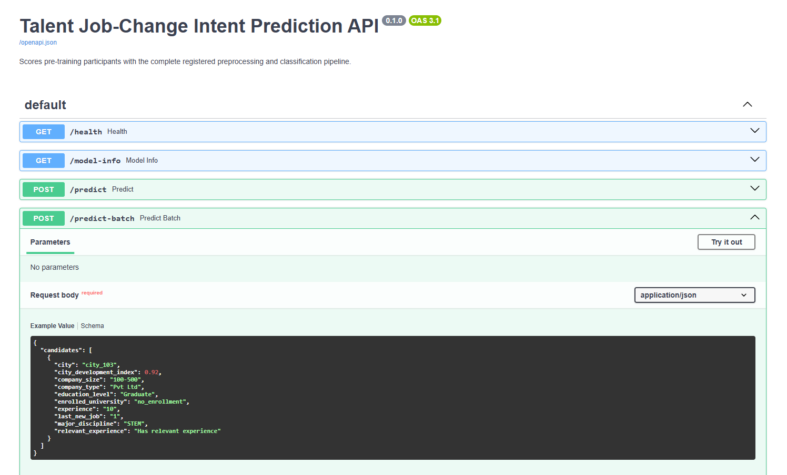
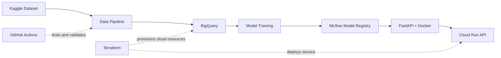

# Talent Job-Change Intent Prediction: An End-to-End MLOps Project

An end-to-end machine learning system that ranks training candidates by predicted job-change intent, serves predictions through a live API, and deploys the model on Google Cloud.

[Live API](https://talent-job-change-intent-api-toficgvqwa-et.a.run.app/docs) · [Presentation](PRESENTATION.pdf) · [Technical Documentation](TECHNICAL.md)

## Executive Summary

<table>
  <tr>
    <td width="18%"><strong>Problem</strong></td>
    <td>Training capacity and budget are limited, while some participants are already looking for other job opportunities before training begins.</td>
  </tr>
  <tr>
    <td width="18%"><strong>Why It Matters</strong></td>
    <td>If limited training slots are allocated without considering job-change intent, recruitment time and training investment may be used less effectively.</td>
  </tr>
  <tr>
    <td width="18%"><strong>Solution</strong></td>
    <td>Built a machine learning system that ranks eligible participants from lower to higher predicted job-change intent, exposes single and batch predictions through an API, and deploys the complete model pipeline on Google Cloud.</td>
  </tr>
</table>

> The model supports human review. It is not intended to automatically reject candidates or replace interviews, assessments, or human judgment.

## Results

### Measured Metrics

| Metric | Dummy Baseline | Selected Model | Improvement |
|---|---:|---:|---:|
| PR-AUC | 0.2492 | **0.5461** | **119.1% higher** |
| ROC-AUC | 0.5000 | **0.8013** | **60.3% higher** |
| Brier Score | 0.1871 | **0.1686** | **9.9% lower** |

At the selected threshold, the model achieved **77.70% recall**, correctly identifying 742 of the 955 participants with job-change intent in the test data.

At **25% training capacity**, model-based selection reduced the job-change intent rate among selected participants from **24.92% to 6.68%**, a **73.19% relative reduction** compared with the same-size baseline.

> These results are measured on held-out historical data. They do not prove future employee retention or financial savings.

### Key Capabilities

- **Verified data pipeline** — validates the source dataset before loading it through Cloud Storage and BigQuery
- **Reproducible model selection** — compares Logistic Regression, Random Forest, and LightGBM using cross-validation and Optuna
- **Reliable model evaluation** — keeps the test set untouched until model and threshold selection are complete
- **Live prediction API** — provides individual probabilities and batch training-priority rankings
- **Cloud deployment workflow** — packages the model with Docker and deploys it to Cloud Run using Terraform, with automated checks in GitHub Actions

## Live Output

  

[Open Live API Documentation](https://talent-job-change-intent-api-toficgvqwa-et.a.run.app/docs)

The interactive API documentation lets users test the deployed model directly.

Users can:

- Check whether the API and model are ready
- View the deployed model version and evaluation metadata
- Submit one participant and receive a job-change intent probability
- Submit multiple participants and receive probabilities plus training-priority ranks
- Inspect the expected input fields and API response format

## Architecture

In simple terms:

1. Terraform provisions the required Google Cloud infrastructure.
2. The data pipeline verifies the source dataset and loads it through Cloud Storage into BigQuery.
3. BigQuery prepares the modeling table used for training.
4. Multiple model and preprocessing options are compared using cross-validation.
5. The selected LightGBM model is evaluated and registered in MLflow.
6. FastAPI serves individual and batch predictions using the registered model pipeline.
7. Docker packages the API and model, which are deployed to Cloud Run.
8. GitHub Actions runs tests, linting, package checks, and Terraform validation.

## Technical Documentation

For detailed explanation about the data pipeline, model design, evaluation, fairness checks, API, infrastructure, and deployment:

[Read Technical Documentation](TECHNICAL.md)

Presentation slides are available in the [PRESENTATION.pdf](PRESENTATION.pdf)

Model evaluation evidence is also available in the
[model-v1.0.0 release](https://github.com/MNAtthoriq/talent-job-change-intent-prediction/releases/tag/model-v1.0.0).

## About Me

**Muhammad Naufal At-Thoriq**

I am an Operations Analyst with two years of experience using data,
automation, and dashboards to improve operational workflows and decision-making.

My professional work includes Python automation, reusable data-processing
pipelines, operational reporting, data validation, and dashboard development.

I am expanding that experience into cloud data engineering, machine learning,
MLOps, and data-driven product development.

[GitHub](https://github.com/MNAtthoriq) ·
[LinkedIn](https://linkedin.com/in/mnatthoriq)
