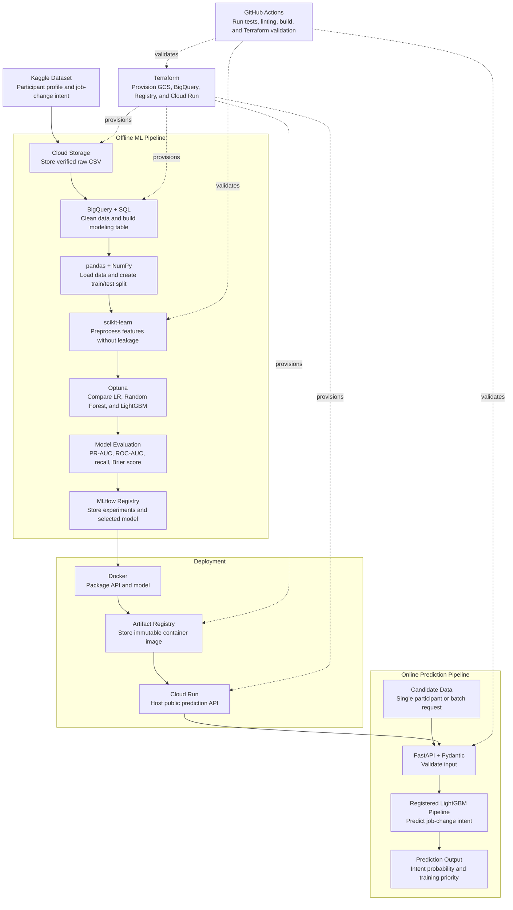

# Talent Job-Change Intent Prediction: An End-to-End MLOps Project


**Live API:** [Interactive documentation](https://talent-job-change-intent-api-toficgvqwa-et.a.run.app/docs) · [Health check](https://talent-job-change-intent-api-toficgvqwa-et.a.run.app/health) · [Model metadata](https://talent-job-change-intent-api-toficgvqwa-et.a.run.app/model-info)

**Model evaluation evidence:** [Download `final_model_results.zip`](https://github.com/MNAtthoriq/talent-job-change-intent-prediction/releases/download/model-v1.0.0/final_model_result.zip) · [View release](https://github.com/MNAtthoriq/talent-job-change-intent-prediction/releases/tag/model-v1.0.0)

## Overview

This project builds and deploys a binary-classification system that ranks eligible data science training participants from lower to higher predicted job-change intent before training begins. It combines a versioned GCP data pipeline, leakage-safe preprocessing, cross-validated model selection, MLflow experiment tracking and model registration, FastAPI serving, Docker packaging, and Terraform-based Cloud Run deployment. The model supports training-slot prioritization; it does not confirm future attrition or make final hiring decisions.

See the [project definition](docs/PROJECT_DEFINITION.md) for the full decision scope.

## Key Results

The selected model was compared with a `DummyClassifier(strategy="prior")` using the same 5-fold stratified cross-validation on the development data.

| Metric      | Dummy Baseline | Selected Model |              Improvement |
| :---------- | -------------: | -------------: | -----------------------: |
| PR-AUC      |         0.2494 |     **0.5553** |              **122.7% better** |
| ROC-AUC     |         0.5000 |     **0.8063** |               **61.3% better** |
| Brier Score |         0.1872 |     **0.1691** |           **9.7% better** |

At the selected classification threshold, the model also achieved **0.7972 recall**, meaning it identified approximately **79.7% of participants with job-change intent** in the development out-of-fold predictions.

For the business comparison, the baseline and model-based approaches use the same number of training slots. Participants with the lowest predicted job-change intent are selected first.

| Training Capacity | Selected Participants | Dummy Baseline<br>Job-Change Intent Rate | Selected Model<br>Job-Change Intent Rate | Relative Reduction |
| ----------------: | --------------------: | ---------------------------------: | ---------------------------------------: | -----------------: |
|               25% |                   958 |                             24.92% |                                **6.68%** |         **73.19% better** |
|               50% |                 1,916 |                             24.92% |                                **8.35%** |         **66.49% better** |
|               75% |                 2,874 |                             24.92% |                               **13.29%** |         **46.67% better** |

See the [model card](docs/MODEL_CARD.md) for the full model summary and the [evaluation plots](docs/assets/) for visual evidence of model performance and business selection results.

## Architecture

The project has two main workflows:

1. An **offline ML pipeline** that prepares data, trains models, evaluates performance, and registers the selected model.
2. An **online prediction pipeline** that serves job-change intent probabilities and training-priority rankings through FastAPI.



## Usage

### Prerequisites

- Python 3.12+
- [`uv`](https://docs.astral.sh/uv/)
- Terraform 1.8+
- Google Cloud CLI
- Docker
- A GCP project with billing enabled

### 1. Clone and install

```bash
git clone https://github.com/MNAtthoriq/talent-job-change-intent-prediction.git
cd talent-job-change-intent-prediction
uv sync --frozen
```

### 2. Authenticate and configure GCP

```bash
gcloud auth login
gcloud auth application-default login

cp infrastructure/terraform/terraform.tfvars.example \
   infrastructure/terraform/terraform.tfvars
```

Set `project_id` in `infrastructure/terraform/terraform.tfvars`, then provision the bootstrap infrastructure:

```bash
terraform -chdir=infrastructure/terraform init
terraform -chdir=infrastructure/terraform apply
```

Terraform creates the Cloud Storage bucket, BigQuery dataset, Artifact Registry repository, Cloud Run service account, required APIs, and `.runtime/project_config.json`.

### 3. Build and validate the data layer

```bash
cp .env.example .env  # Kaggle token is optional for the public dataset
uv run talent-data run
```

This command acquires the pinned dataset, validates its file contract, uploads it to Cloud Storage, loads it into BigQuery, builds the modeling table, and writes data-quality reports.

### 4. Train and register the model

```bash
uv run talent-modeling prepare

uv run talent-modeling tune \
  --trials 40 \
  --cv-folds 5 \
  --timeout-minutes 30

uv run talent-modeling finalize
uv run talent-modeling export-results
```

`tune` uses development data only. `finalize` evaluates the selected pipeline once on the untouched test set and registers it in MLflow with the `candidate` alias.

### 5. Run the API locally

```bash
uv run talent-api
```

Open `http://127.0.0.1:8000/docs`.

### 6. Deploy to Cloud Run

Deployment requires a clean Git working tree:

```bash
git status
uv run talent-deploy
uv run talent-smoke-test
```

The deployment command exports the registered model, builds and pushes a Docker image, resolves its immutable digest, applies Terraform, deploys Cloud Run, and runs an end-to-end smoke test.

### Teardown

```bash
terraform -chdir=infrastructure/terraform destroy
```

The development configuration allows Terraform to delete objects in the project-managed Cloud Storage bucket and tables in the project-managed BigQuery dataset. Use it wisely.

## Repository Structure

```text
.
├── .github/workflows/ci.yml                # Python and Terraform CI checks
├── docs/
│   ├── PROJECT_DEFINITION.md               # Business decision and evaluation contract
│   └── MODEL_CARD.md                       # Model performance, risks, and lineage
├── infrastructure/terraform/               # GCP infrastructure as code
├── sql/                                    # BigQuery transformation and data-quality SQL
├── src/talent_job_change_intent_prediction/
│   ├── data/                               # Kaggle → GCS → BigQuery pipeline
│   ├── modeling/                           # Splitting, preprocessing, tuning, evaluation
│   ├── serving/                            # FastAPI schemas, service, and endpoints
│   └── deployment/                         # Model export, Cloud Run deployment, smoke test
├── tests/                                  # Unit and contract tests
├── reports/generated/                      # Rebuildable model and data reports; not committed
├── .env.example                            # Optional local environment overrides
├── Dockerfile                              # Reproducible non-root API container
├── pyproject.toml                          # Dependencies and CLI entry points
├── uv.lock                                 # Locked Python environment
└── README.md
```

---

## Author

**Muhammad Naufal At-Thoriq**

- GitHub: [MNAtthoriq](https://github.com/MNAtthoriq)
- LinkedIn: [Muhammad Naufal At-Thoriq](https://linkedin.com/in/mnatthoriq)

**Dataset:** [HR Analytics: Job Change of Data Scientists — Kaggle](https://www.kaggle.com/datasets/arashnic/hr-analytics-job-change-of-data-scientists)

