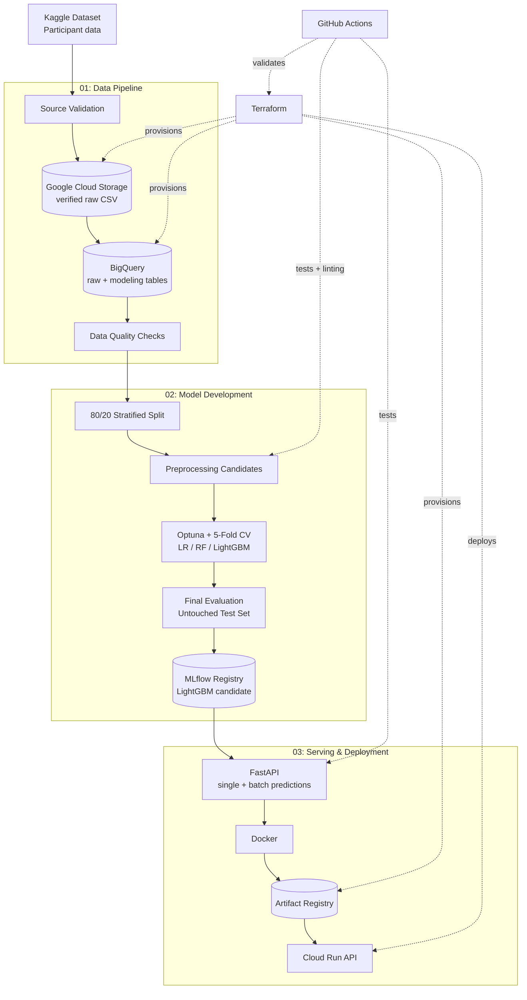

# Talent Job-Change Intent Prediction System — Technical Documentation

This document explains how the data pipeline, model development, evaluation, API, and Google Cloud deployment are built and run.

[← Back to Project README](README.md)

## Data Sources

The project uses the public
[HR Analytics: Job Change of Data Scientists](https://www.kaggle.com/datasets/arashnic/hr-analytics-job-change-of-data-scientists)
dataset from Kaggle, pinned to dataset version `1`.

| Data | Format | Purpose |
|---|---|---|
| Training participant data | CSV | Registration, education, and employment features used for modeling |
| `target` | Binary label | `0` = not looking for a job change, `1` = looking for a job change |

The dataset contains **19,158 rows**:

| Split | Rows | Positive Rows | Positive Rate |
|---|---:|---:|---:|
| Development | 15,326 | 3,822 | 24.94% |
| Test | 3,832 | 955 | 24.92% |

The source file is checked against its expected row count, size, columns, and SHA-256 before it is used.

## Usage

### Prerequisites

- Python 3.12+
- [uv](https://docs.astral.sh/uv/)
- Terraform 1.8+
- Google Cloud CLI (`gcloud`)
- Docker
- Google Cloud project with billing enabled

### 1. Clone the Repository

```bash
git clone https://github.com/MNAtthoriq/talent-job-change-intent-prediction.git
cd talent-job-change-intent-prediction

uv sync --frozen
```

### 2. Authenticate with Google Cloud

```bash
gcloud auth login
gcloud auth application-default login
```

### 3. Provision Google Cloud Resources

```bash
cp infrastructure/terraform/terraform.tfvars.example \
   infrastructure/terraform/terraform.tfvars
```

Set `project_id` in `infrastructure/terraform/terraform.tfvars`, then run:

```bash
terraform -chdir=infrastructure/terraform init
terraform -chdir=infrastructure/terraform apply
```

Terraform creates:

- Google Cloud Storage bucket
- BigQuery dataset
- Artifact Registry repository
- Cloud Run service account
- Required Google Cloud APIs
- Local runtime configuration

### 4. Build and Validate the Data Layer

```bash
cp .env.example .env
uv run talent-data run
```

This command:

1. Downloads or reuses the pinned Kaggle dataset.
2. Verifies the source file contract.
3. Stores the verified raw file in Cloud Storage.
4. Loads the data into BigQuery.
5. Builds the modeling table with SQL.
6. Runs data-quality checks and writes a validation report.

### 5. Prepare the Modeling Data

```bash
uv run talent-modeling prepare
```

This creates the reproducible development/test split and verifies the preprocessing options.

### 6. Tune Candidate Models

```bash
uv run talent-modeling tune \
  --trials 40 \
  --cv-folds 5 \
  --timeout-minutes 30
```

The search compares:

- Logistic Regression
- Random Forest
- LightGBM
- Multiple preprocessing configurations

PR-AUC is used as the primary model-selection metric.

### 7. Finalize and Register the Model

```bash
uv run talent-modeling finalize
uv run talent-modeling export-results
```

`finalize` evaluates the selected pipeline once on the untouched test set and registers it in MLflow with the `candidate` alias.

### 8. Run the API Locally

```bash
uv run talent-api
```

Open:

```text
http://127.0.0.1:8000/docs
```

| Endpoint | Purpose |
|---|---|
| `GET /health` | Check API and model readiness |
| `GET /model-info` | View model version, lineage, features, and test metrics |
| `POST /predict` | Score one participant |
| `POST /predict-batch` | Score multiple participants and return priority ranks |

### 9. Deploy to Cloud Run

Deployment requires a clean Git working tree.

```bash
git status
uv run talent-deploy
uv run talent-smoke-test
```

The deployment workflow exports the registered model, builds and pushes a Docker image, resolves its immutable digest, applies Terraform, deploys Cloud Run, and runs a smoke test.

### Teardown

```bash
terraform -chdir=infrastructure/terraform destroy
```

## Repository Structure

```text
talent-job-change-intent-prediction/
├── .github/
│   └── workflows/
│       └── ci.yml
│
├── infrastructure/
│   └── terraform/
│
├── sql/
│
├── src/
│   └── talent_job_change_intent_prediction/
│       ├── data/
│       ├── modeling/
│       ├── serving/
│       └── deployment/
│
├── tests/
├── reports/
│   └── generated/
│
├── .env.example
├── Dockerfile
├── pyproject.toml
├── uv.lock
├── README.md
└── TECHNICAL.md
```

| Path | Purpose |
|---|---|
| `.github/workflows/` | Runs automated Python and Terraform checks |
| `infrastructure/terraform/` | Creates and configures Google Cloud resources |
| `sql/` | Builds and validates the BigQuery modeling data |
| `src/.../data/` | Kaggle → Cloud Storage → BigQuery data pipeline |
| `src/.../modeling/` | Data splitting, preprocessing, tuning, evaluation, and registration |
| `src/.../serving/` | FastAPI schemas, endpoints, and model service |
| `src/.../deployment/` | Model export, Cloud Run deployment, and smoke tests |
| `tests/` | Unit and contract tests |
| `reports/generated/` | Rebuildable data and model evaluation outputs |

## Architecture



In simple terms:

1. Terraform provisions the required Google Cloud infrastructure.
2. The data pipeline verifies the Kaggle source file before storing it in Cloud Storage.
3. BigQuery builds and validates the modeling table.
4. The data is split into development and untouched test sets.
5. Logistic Regression, Random Forest, LightGBM, and preprocessing options are compared using Optuna and 5-fold cross-validation.
6. The selected LightGBM pipeline is evaluated once on the test set and registered in MLflow.
7. FastAPI loads the registered pipeline and serves individual and batch predictions.
8. Docker packages the service, Artifact Registry stores the image, and Cloud Run hosts the public API.
9. GitHub Actions checks Python code and Terraform configuration on pushes and pull requests.

## Technical Notes

### Model and Decision Design

| Decision | Implementation |
|---|---|
| **Prediction target** | Predict whether a participant is looking for a job change, not confirmed future attrition |
| **Supported decision** | Rank eligible participants from lower to higher predicted job-change intent before training |
| **Human role** | The model supports review; it does not automatically reject applicants |
| **Data split** | Reproducible stratified 80/20 development-test split with random state `42` |
| **Model selection** | 5-fold stratified cross-validation using development data only |
| **Primary metric** | PR-AUC because the positive class is about 25% of the data |
| **Threshold selection** | F2 on out-of-fold development predictions |
| **Protected feature** | `gender` is excluded from the deployable model and retained only for fairness auditing |
| **Unavailable feature** | `training_hours` is excluded because it is not known before training begins |
| **Identifier** | `enrollee_id` is excluded from modeling |
| **City** | Evaluated during model selection and excluded by the selected pipeline |

### Selected Model

| Item | Value |
|---|---|
| Model | LightGBM binary classifier inside a scikit-learn pipeline |
| Registered name | `talent-job-change-intent-classifier` |
| Version | `1` |
| Alias | `candidate` |
| Selected Optuna trial | `22` of `40` |
| Preprocessing | `ordinal_aware_without_city` |
| Classification threshold | `0.3792` |

Selected preprocessing includes median imputation and scaling for numeric features,
constant or most-frequent imputation for categorical features, one-hot encoding
for nominal features, and ordered encoding for ordinal features.

Key LightGBM parameters:

| Parameter | Value |
|---|---:|
| `n_estimators` | 550 |
| `learning_rate` | 0.01917 |
| `num_leaves` | 87 |
| `max_depth` | 14 |
| `min_child_samples` | 100 |
| `subsample` | 0.64375 |
| `colsample_bytree` | 0.67147 |
| `reg_alpha` | 8.93345 |
| `reg_lambda` | 8.48791 |
| `class_weight` | `balanced` |

### Detailed Evaluation

#### Development Model Selection

| Metric | Result |
|---|---:|
| Train PR-AUC | 0.5795 |
| Mean Validation PR-AUC | **0.5553** |
| Validation PR-AUC Std. Dev. | 0.0116 |
| Train-Validation Gap | 0.0242 |
| Mean Validation ROC-AUC | 0.8063 |
| Out-of-Fold Recall | 0.7972 |
| F2-Selected Threshold | 0.3792 |

#### Untouched Test Set

| Metric | Dummy Baseline | Selected Model |
|---|---:|---:|
| PR-AUC | 0.2492 | **0.5461** |
| ROC-AUC | 0.5000 | **0.8013** |
| Brier Score | 0.1871 | **0.1686** |
| Recall | — | **0.7770** |
| Precision | — | 0.4812 |
| F1 | — | 0.5943 |
| F2 | — | 0.6919 |

At threshold `0.3792`, the model correctly identifies **742 of 955**
participants with job-change intent.

#### Training-Capacity Comparison

Both approaches use the same number of training slots.

| Training Capacity | Selected Participants | Baseline Intent Rate | Model-Selected Intent Rate | Relative Reduction |
|---:|---:|---:|---:|---:|
| 25% | 958 | 24.92% | **6.68%** | **73.19%** |
| 50% | 1,916 | 24.92% | **8.35%** | **66.49%** |
| 75% | 2,874 | 24.92% | **13.29%** | **46.67%** |

These results measure performance on historical held-out data. They do not
prove real-world financial savings or future employee retention.

### Fairness Audit

`gender` is excluded from the deployable model and used only for evaluation.

| Group | Rows | Positive Rate | Predicted-Positive Rate | Recall | PR-AUC |
|---|---:|---:|---:|---:|---:|
| Female | 253 | 24.90% | 40.71% | 0.8095 | 0.6213 |
| Male | 2,648 | 22.70% | 36.29% | 0.7404 | 0.5136 |
| Other | 35 | 28.57% | 48.57% | 0.8000 | 0.7922 |
| Missing | 896 | 31.36% | 51.45% | 0.8470 | 0.5954 |

Observed maximum gaps:

- Predicted-positive rate: `0.1516`
- Recall: `0.1065`

This is a descriptive audit, not proof of fairness. Some groups are small and
many records have missing gender values.

### Model Lineage

| Item | Value |
|---|---|
| Dataset version | Kaggle dataset version `1` |
| Source SHA-256 | `8b78da3482032500df40d5359c36ba4a59e28ccd6fc272b050dcf6dee37f114c` |
| Source Git commit | `0168c5d416bf059a8a3b8716a912d6bb4bdefec4` |
| Registered model version | `1` |
| MLflow alias | `candidate` |
| Optuna trial | `22` of `40` |

The `/model-info` API endpoint also exposes the deployed model version,
source hash, Git commit, selected trial, preprocessing configuration, features,
parameters, and test metrics.

### Limitations

1. **Intent is not outcome.** The target records stated job-change intent, not confirmed resignation, retention, or employment.
2. **Historical data may not represent future use.** Performance can change across countries, time periods, labor markets, or training programs.
3. **The model is not causal.** Feature associations should not be interpreted as causes of job-change intent.
4. **Proxy risk remains.** Education and employment-history features may still reflect socioeconomic differences.
5. **The threshold is context-dependent.** It should be reviewed if training capacity or business priorities change.
6. **Predicted probabilities are estimates.** Individual scores should not be treated as guaranteed outcomes.
7. **Fairness evidence is limited.** Some groups are small or contain substantial missing values.
8. **No verified financial outcome is available.** The dataset does not contain actual training costs or realized employment outcomes.
9. **The public API is a demonstration.** Production use would require stronger access controls, monitoring, and operational safeguards.

### Key Learnings

| Concept | What I Learned |
|---|---|
| **Business-Aligned Evaluation** | Model quality should be evaluated against the real decision, so the project compares job-change intent at the same training capacity instead of only reporting classification metrics. |
| **Protected Test Set** | Model, preprocessing, and threshold choices should be completed before the final test set is used. |
| **Data Lineage** | Pinning the dataset version and hash makes it possible to trace a trained model back to the exact source data. |
| **Training-to-Serving Consistency** | Registering the complete preprocessing and model pipeline reduces differences between training and API predictions. |
| **Reproducible Deployment** | Locked dependencies, Docker, Terraform, model metadata, and CI checks make the system easier to rebuild and review. |
| **Responsible Scope** | A probability is decision support, not proof of a future employment outcome and not a replacement for human review. |

## About Me

I am an Operations Analyst with two years of experience using data,
automation, and dashboards to improve operational workflows and decision-making.

My professional work includes Python automation, reusable data-processing
pipelines, operational reporting, data validation, and dashboard development.

I am expanding that experience into cloud data engineering, machine learning,
MLOps, and data-driven product development.

[GitHub](https://github.com/MNAtthoriq) ·
[LinkedIn](https://linkedin.com/in/mnatthoriq)